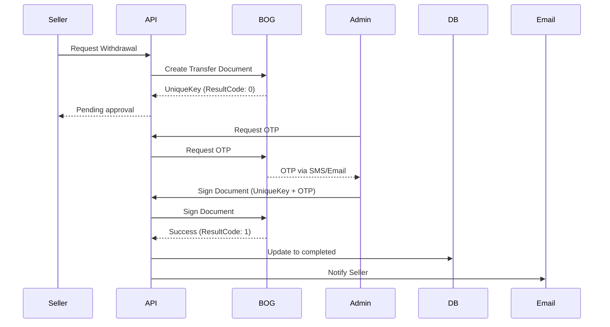
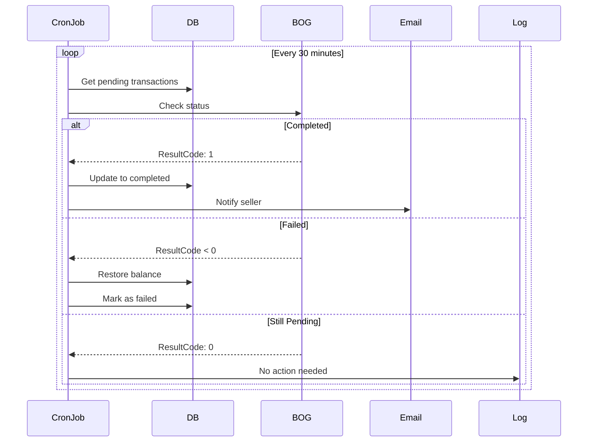

# BOG Admin API Documentation

## Overview
Admin endpoints for managing BOG bank transfers, checking account balance, and signing pending documents.

## Base URL
```
https://api.soulart.ge/v1/admin/bog
```

## Authentication
All endpoints require:
- JWT token in Authorization header
- Admin role

## Endpoints

### 1. Get Account Balance
Get the current balance of SoulArt company account.

**Endpoint:** `GET /balance`

**Response:**
```json
{
  "success": true,
  "data": {
    "accountNumber": "GE72BG0000000609635881",
    "availableBalance": 15000.50,
    "currentBalance": 15000.50,
    "currency": "GEL"
  }
}
```

---

### 2. Get Pending Documents
Get all documents waiting for signature.

**Endpoint:** `GET /pending-documents`

**Response:**
```json
{
  "success": true,
  "count": 3,
  "data": [
    {
      "UniqueKey": 144413693,
      "DocumentNo": "SA-1761603100889",
      "Amount": 1,
      "BeneficiaryName": "Levan Beroshvili",
      "BeneficiaryAccountNumber": "GE06BG0000000593139600",
      "ResultCode": 0,
      "CreatedDate": "2025-10-28T02:11:40Z"
    }
  ]
}
```

---

### 3. Get Document Status
Check status of a specific document by UniqueKey.

**Endpoint:** `GET /document/:uniqueKey`

**Response:**
```json
{
  "success": true,
  "data": {
    "UniqueKey": 144413693,
    "ResultCode": 0,
    "Status": "Ready to Sign"
  }
}
```

**Result Codes:**
- `0` - Ready to Sign (pending)
- `1` - Completed successfully
- `< 0` - Failed (see error codes)

---

### 4. Request OTP
Request OTP code for signing documents.

**Endpoint:** `POST /request-otp`

**Response:**
```json
{
  "success": true,
  "message": "OTP გამოგზავნილია თქვენს ტელეფონზე/ელფოსტაზე"
}
```

**Note:** OTP will be sent to the phone/email registered in Business Online.

---

### 5. Sign Document
Sign a pending document with OTP code.

**Endpoint:** `POST /sign-document`

**Request Body:**
```json
{
  "uniqueKey": 144413693,
  "otp": "123456"
}
```

**Response:**
```json
{
  "success": true,
  "message": "დოკუმენტი წარმატებით ხელმოწერილია და შესრულებულია"
}
```

---

## Balance Management Endpoints

### 6. Get Pending Withdrawals
Get all seller withdrawal requests waiting for signature.

**Endpoint:** `GET /balance/admin/pending-withdrawals`

**Response:**
```json
{
  "success": true,
  "count": 2,
  "data": [
    {
      "_id": "transaction_id",
      "seller": {
        "_id": "seller_id",
        "email": "seller@example.com",
        "ownerFirstName": "Levan",
        "ownerLastName": "Beroshvili"
      },
      "amount": -50,
      "type": "withdrawal_pending",
      "description": "თანხის გატანის მოთხოვნა BOG-ში შექმნილია და ელოდება დამტკიცებას (GE06...) - BOG UniqueKey: 144413693",
      "createdAt": "2025-10-28T02:11:40Z"
    }
  ]
}
```

---

## Automated Status Checking

### Cron Job
The system automatically checks pending transfer statuses every 30 minutes.

**What it does:**
1. Finds all `withdrawal_pending` transactions
2. Checks their status in BOG API
3. If completed (ResultCode = 1):
   - Updates balance
   - Marks transaction as `withdrawal_completed`
   - Sends email to seller
4. If failed (ResultCode < 0):
   - Restores seller balance
   - Marks transaction as `withdrawal_failed`
   - Updates transaction description with error

---

## Workflow

### Normal Transfer Flow:



### Auto-Check Flow:



---

## Error Handling

### Common Errors:

**Invalid Credentials (400):**
```json
{
  "statusCode": 400,
  "message": "Failed to authenticate with BOG API"
}
```

**Document Not Found (400):**
```json
{
  "statusCode": 400,
  "message": "Failed to fetch document status"
}
```

**Invalid OTP (400):**
```json
{
  "statusCode": 400,
  "message": "Failed to sign document"
}
```

---

## Best Practices

1. **Check balance before mass withdrawals** - Use `/balance` endpoint
2. **Monitor pending documents** - Check `/pending-documents` regularly
3. **Sign documents promptly** - Sellers are waiting for their money
4. **Review failed transfers** - Check why they failed and resolve issues
5. **Keep OTP secure** - Don't share or log OTP codes

---

## Testing

### Test Document Creation:
```bash
curl -X POST https://api.soulart.ge/v1/balance/withdrawal/request \
  -H "Authorization: Bearer <seller_token>" \
  -H "Content-Type: application/json" \
  -d '{"amount": 1}'
```

### Check Pending:
```bash
curl -X GET https://api.soulart.ge/v1/admin/bog/pending-documents \
  -H "Authorization: Bearer <admin_token>"
```

### Request OTP:
```bash
curl -X POST https://api.soulart.ge/v1/admin/bog/request-otp \
  -H "Authorization: Bearer <admin_token>"
```

### Sign Document:
```bash
curl -X POST https://api.soulart.ge/v1/admin/bog/sign-document \
  -H "Authorization: Bearer <admin_token>" \
  -H "Content-Type: application/json" \
  -d '{"uniqueKey": 144413693, "otp": "123456"}'
```

---

## Notes

- OTP expires after a few minutes
- Documents can only be signed once
- Failed transfers automatically restore seller balance
- Completed transfers trigger email notifications
- All actions are logged for audit trail
